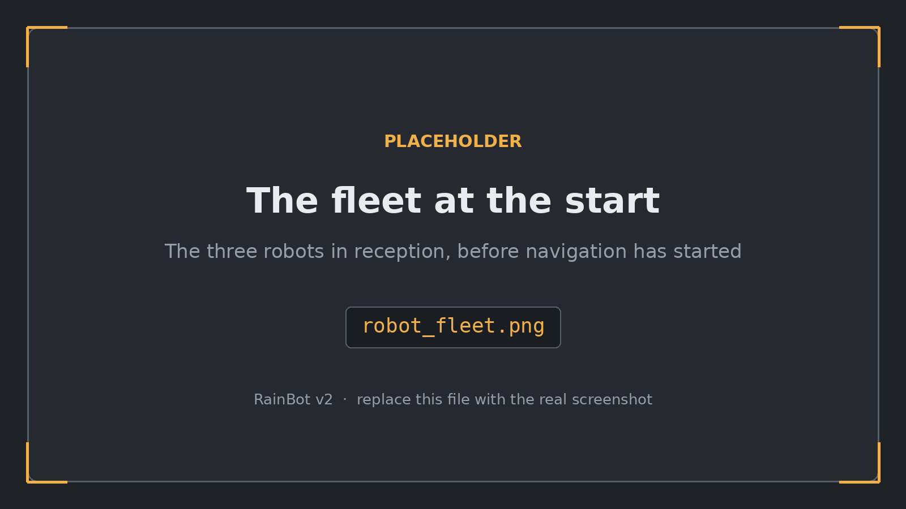
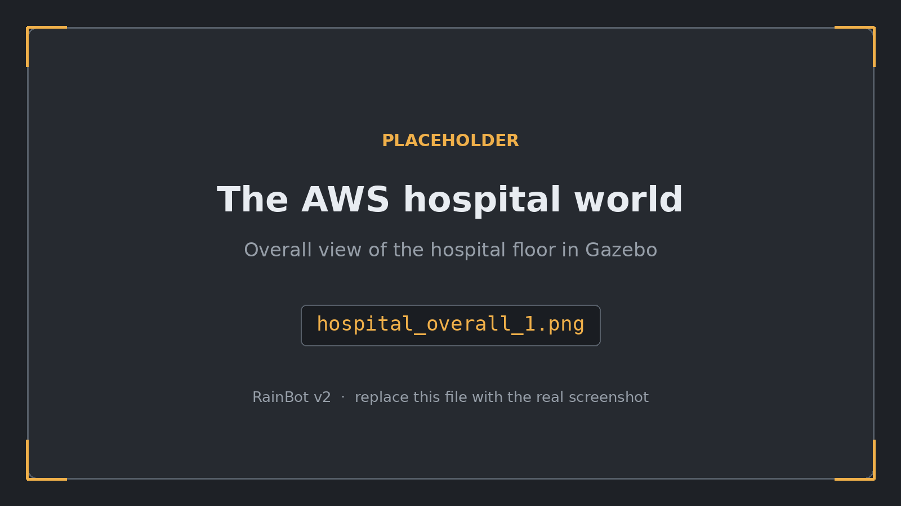
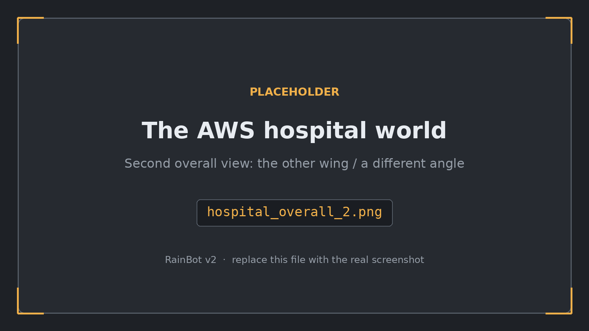
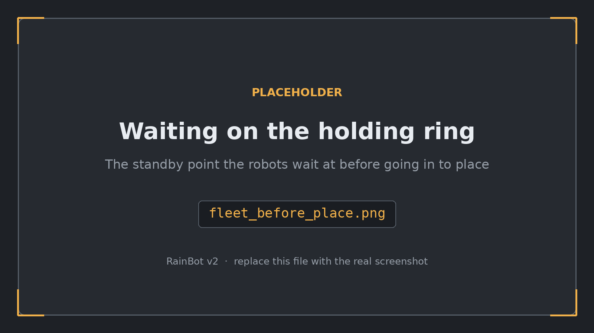
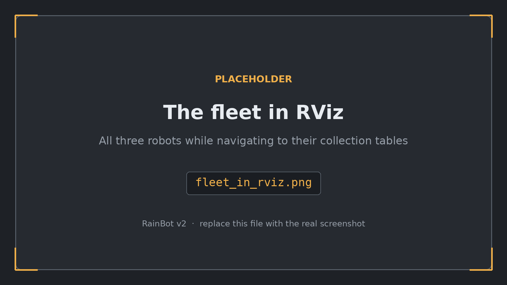
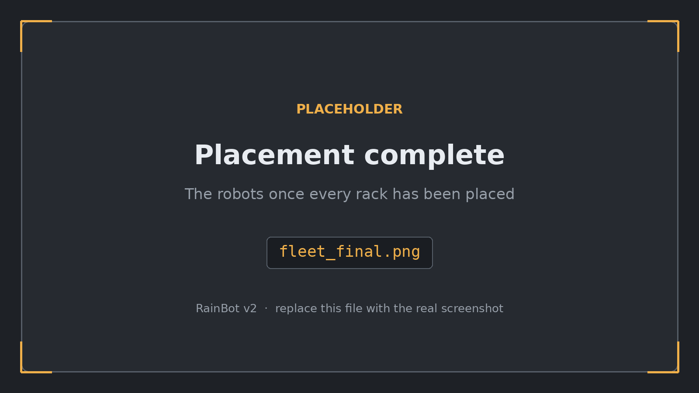

# RainBot: an autonomous mobile cobot for pick-and-place

**RainBot** is a mobile cobot: a **Clearpath Husky A200** mobile base
carrying a **Franka Emika FR3** 7-DOF arm with a **Franka Hand** gripper,
simulated in ROS 2 Humble + Gazebo Harmonic. Pairing a full arm with a mobile
base means RainBot isn't limited to whatever is within reach of a fixed
pedestal: it can navigate a whole warehouse floor and manipulate objects
wherever they are, which is exactly what pick-and-place work in the real world
demands: the parts, bins and drop-off points are rarely all next to each other.


RainBot runs one complete autonomous mission end to end: it localizes itself
on a saved map of a warehouse, drives to a table, picks three coloured cubes off
it one at a time using its front camera, carries each across the room, places it
on the matching-coloured column, verifies the placement actually landed, and
parks. The same mobility that lets it reach the table also lets it carry each
cube anywhere else in the mapped space; this mission is one example of the
class of mobile pick-and-place tasks the platform is built for.

**Version 2 adds a three-robot fleet.** The same robot, three of them, in the
**AWS RoboMaker hospital**: each collects a sample rack from a different ward,
carries it across the building to a shared delivery table, places it in its own
slot, and parks — with a central task manager assigning the errands and keeping
the three of them out of each other's way. See
[Version 2: the hospital fleet](#version-2-the-hospital-fleet).



*The fleet in the reception lobby, before navigation has started.*

Everything RainBot needs is in this repository. There are no external
description packages to clone.

---

## Contents

- [Requirements](#requirements)
- [Build](#build)
- [Run the mission](#run-the-mission)
- [What the mission does](#what-the-mission-does)
- [Version 2: the hospital fleet](#version-2-the-hospital-fleet)
- [Repository layout](#repository-layout)
- [The robot](#the-robot)
- [Controllers](#controllers)
- [Perception](#perception)
- [Navigation and localization](#navigation-and-localization)
- [Startup sequencing](#startup-sequencing)
- [RViz](#rviz)
- [Building a new map](#building-a-new-map)
- [Vendored third-party assets](#vendored-third-party-assets)
- [Tuned constants worth knowing](#tuned-constants-worth-knowing)
- [Performance](#performance)
- [Troubleshooting](#troubleshooting)
- [Roadmap](#roadmap)

---

## Requirements

| Component | Version |
| --- | --- |
| Ubuntu | 22.04 |
| ROS 2 | Humble |
| Gazebo | Harmonic (`gz-sim8`, tested on 8.14.0) |
| `ros_gz` | Harmonic variant: `ros-humble-ros-gzharmonic-*` |

### A working GPU driver: check this before anything else

**Gazebo must render on a real GPU.** If OpenGL falls back to Mesa's software
rasteriser (`llvmpipe`), the simulation still starts and still looks correct,
but it crawls, pegs every CPU core and cooks the machine; detection never
fires and the pick aborts. A faster CPU does not help; it just runs hotter.

```bash
sudo apt install -y mesa-utils
glxinfo -B | grep -E "OpenGL vendor|OpenGL renderer"
```

`llvmpipe`, `softpipe` or `swrast` means software rendering; fix that first.
See [Troubleshooting](#everything-is-slow-and-the-fans-max-out).

### Gazebo Harmonic

Harmonic is **not** in the Ubuntu archive; it comes from the OSRF repository,
which has to be added first. Installing the ROS bridge alone is not enough:

```bash
sudo apt install -y lsb-release gnupg curl
sudo curl https://packages.osrfoundation.org/gazebo.gpg \
    --output /usr/share/keyrings/pkgs-osrf-archive-keyring.gpg
echo "deb [arch=$(dpkg --print-architecture) \
signed-by=/usr/share/keyrings/pkgs-osrf-archive-keyring.gpg] \
http://packages.osrfoundation.org/gazebo/ubuntu-stable $(lsb_release -cs) main" \
    | sudo tee /etc/apt/sources.list.d/gazebo-stable.list > /dev/null
sudo apt update && sudo apt install -y gz-harmonic
```

### ROS-side dependencies

```bash
sudo apt update
sudo apt install -y \
    ros-humble-ros-gzharmonic \
    ros-humble-moveit \
    ros-humble-navigation2 ros-humble-nav2-bringup \
    ros-humble-slam-toolbox \
    ros-humble-robot-localization \
    ros-humble-joint-trajectory-controller \
    ros-humble-diff-drive-controller \
    ros-humble-joint-state-broadcaster
```

`gz_ros2_control` and `pymoveit2` are **included in this repository** (under
`src/`) and are built from source with the rest of the workspace; there is
nothing extra to clone.

### World assets are vendored: no download on first run

The Tugbot warehouse world pulls 7 models from Gazebo Fuel (warehouse shell,
shelves, pallets, carts, the Tugbot itself). Those models are vendored into
`src/pickplace_arm_description/fuel_cache/` (~17 MB, thumbnails stripped), and
`gazebo.launch.py` points the Fuel client's cache root at that directory via
`GZ_FUEL_CACHE_PATH` before Gazebo starts. The world resolves entirely from
the repo on the very first launch: no network access needed, and nothing is
written to `~/.gz/fuel`.

---

## Build

`gz_ros2_control` selects its Gazebo backend from the `GZ_VERSION` environment
variable at configure time, so it **must** be set before building:

```bash
cd ~/RainBot
export GZ_VERSION=harmonic
source /opt/ros/humble/setup.bash
colcon build --symlink-install
source install/setup.bash
```

`--symlink-install` is recommended: URDF, launch, config and RViz files are then
symlinked from `src/`, so editing them takes effect without rebuilding. Python
modules are still copied, so **changing a `.py` under
`pickplace_arm_bringup/` does need a rebuild** of that package:

```bash
colcon build --packages-select pickplace_arm_bringup --symlink-install
```

A clean build of all five packages takes roughly 15 seconds.

---

## Run the mission

```bash
cd ~/RainBot
export GZ_VERSION=harmonic
source install/setup.bash
ros2 launch pickplace_arm_bringup mission_pickPlace.launch.py
```

Launch arguments:

| Argument | Default | Effect |
| --- | --- | --- |
| `use_rviz` | `true` | Start RViz with the full mission layout. |
| `use_gazebo_gui` | `true` | `false` runs Gazebo headless (server only). Sensor rendering happens on the server, so nothing is lost but the scenery, and it saves a lot of RAM. |

On a machine with nothing else running, the mission starts driving **13–18
seconds** after launch (measured across runs), and a full three-box run takes
about **6 minutes** of wall clock.

> **Before every launch, make sure no simulator is still running.** See
> [Troubleshooting](#troubleshooting): this is the single most common cause of
> strange failures in this project.

To run the three-robot fleet instead, see
[Version 2: the hospital fleet](#version-2-the-hospital-fleet).

---

## What the mission does

The world is the OpenRobotics *Tugbot in Warehouse* Fuel scene. The props are
spawned into it by the launch file:

- a **table** at map (2.30, 0.00), top surface 0.30 m off the floor
- three **6 cm cubes** on the table (red, green, blue)
- three **columns** at map x = −1.0, 20 cm square, of heights **0.30 / 0.40 /
  0.50 m**, each painted the colour of the cube that belongs on it


*The Tugbot warehouse: the robot, the table with the three cubes, and the three
matching columns.*

For each cube, in order:

1. **Navigate** to the table with Nav2 on the saved map (AMCL localization).
2. **Approach**: a front-camera colour visual servo drives the base until the
   cube sits under the gripper's fixed action point.
3. **Grasp**: the arm descends straight down, the jaws close, and the grasp is
   *verified* from the finger joint position before anything else happens.
4. **Weld**: a Gazebo `DetachableJoint` rigidly attaches the cube. Friction
   alone lost the box on every carry; the weld cannot slip.
5. **Carry**: the arm tucks into a compact carry pose and the base drives
   across the room.
6. **Place**: a second visual servo centres the base on the matching column,
   the arm lowers the cube onto its top and releases.
7. **Verify**: the front camera looks for the cube *above the column top*. If
   it is not there, the placement is reported FAILED rather than silently
   assumed good.


*Close-up on the arm and gripper picking a cube off the table.*

Finally the robot drives to a parking pose and reports `MISSION 2: DONE`.

Typical verified output:

```
[place] verified: red box at z=0.201 (column top ~0.198)
[place] verified: green box at z=0.303 (column top ~0.298)
[place] verified: blue box at z=0.405 (column top ~0.398)
=== MISSION 2: DONE ===
```

---

## Version 2: the hospital fleet

Version 1 is one robot, one warehouse, three cubes. **Version 2 keeps all of
that and adds a three-robot fleet** working a building instead of a room: the
**AWS RoboMaker hospital**, one floor, 183 model instances over roughly
**25 × 51 m** of real interior walls, with a floor and a ceiling.

The world is not empty, either. Seventeen `<actor>` skeletons populate it:
people standing about the wards and lobby, four walking down each of the east
and west corridors, and two wheelchairs being pushed along the aisles. Actors
carry no collision geometry, but the LIDAR is a rendering sensor and *does* see
them, so they are real obstacles to the costmaps.



*The AWS hospital floor in Gazebo, with `hospital_ceiling` unticked to see
inside.*



*The same floor from another angle: the reception lobby and both wings.*

### Run it

```bash
cd ~/RainBot
export GZ_VERSION=harmonic
source install/setup.bash
ros2 launch pickplace_arm_bringup hospital_mission.launch.py
```

| Argument | Default | Effect |
| --- | --- | --- |
| `use_rviz` | `true` | Start RViz with the generated fleet layout (declared by the included fleet launch). |
| `depart_stagger` | `20.0` | Seconds between one robot leaving reception and the next being dispatched. |

Three launch files share the same world:

| Launch | What it runs |
| --- | --- |
| `hospital_fleet.launch.py` | The three robots, their Nav2 stacks, AMCL and RViz — no props, no errands. |
| `hospital_mission.launch.py` | The fleet **plus** four tables, three racks and the task manager: the whole job. |
| `mission_rackPlace.launch.py` | The **single-robot** run of version 1, moved into the hospital and carrying racks instead of cubes. |

### The job

The three robots spawn in a 2.0 m triangle in the reception lobby, centred on
map (0.00, 8.75) and all facing the desk. Each is given one errand at dispatch:

| Robot | Rack | Collection table | Ward |
| --- | --- | --- | --- |
| `r1` | red | (−8.90, −5.00) | west wing, north end |
| `r2` | green | (8.50, −19.50) | east wing, south |
| `r3` | blue | (−7.50, −26.50) | far south hall |

Every robot then runs the same errand, which is 29–40 m of driving:

1. **Collect** — navigate to the collection table on a tightened yaw tolerance,
   confirm with the camera that the rack really is in view, and claw-pick it
   off the table top.
2. **Carry** — back off and drive to the shared delivery table at
   (−3.50, 10.00).
3. **Hold** — stop on a **3 m ring** around that table, on a bearing reserved
   for this robot, and wait its turn.
4. **Claim** — ask the task manager for a delivery slot.
5. **Deliver** — drive to the standoff, *measure* the table's front face with
   the lidar rather than trusting Nav2, square up on it, and lower the rack
   into its slot. The three slots are 0.38 m apart.
6. **Park** — take a reserved vertex on a second triangle at (1.00, 14.25) and
   report the outcome.

Every step that can fail has a recovery. A rack that is not in view triggers a
bounded sweep; a refused Nav2 goal is treated as a localization problem and
answered with a rotate-in-place re-localize; and a placement that never gets a
usable slot reading falls back to setting the rack down on the measured table
face rather than carrying it away.



*The standby point: robots hold on the ring around the delivery table, each on
its own reserved bearing, until the task manager grants them the table.*

### Keeping three robots out of each other's way

Three robots that leave a 3.46 m triangle at the same instant, all heading for
the same lobby exit, drive into each other. Coordination therefore lives in the
one node that can see all three at once — `task_manager.py` — and takes three
forms:

| Rule | What it does |
| --- | --- |
| **Departure stagger** | `depart_stagger` seconds between departures, so the reception triangle empties one robot at a time. |
| **Delivery queue** | One reserved waiting *bearing* per robot on the 3 m holding ring, so all three make the trip as soon as they are carrying and wait at the table rather than back at their own benches. |
| **Delivery lock** | Only one robot works at the delivery table at a time: its standoff, its creep-in and its arm placement all happen inside a space barely wider than one robot. |

Neither rule costs much here — the errands are long enough that the robots are
naturally spread out for almost the whole run, and the locks only bite at the
two moments they are all in the same place.

None of it replaces the robots' own obstacle avoidance: each still sees the
others on its LIDAR and plans around them in its local costmap, which is what
handles incidental encounters in a corridor.

`task_manager.py` also draws the whole job in RViz — collection tables coloured
by the rack they carry, the standoffs, the delivery slots and their owners, and
the parking triangle — and publishes a status line for each robot.



*The generated fleet RViz layout while the three robots are navigating to their
collection tables, with the task manager's markers on top.*

### One description, three robots

Running three of the same robot means every frame and every topic has to be
namespaced, and several things in the stack do not namespace themselves:

| Module | What it solves |
| --- | --- |
| `ns_params.py` | Rewrites a single-robot Nav2/AMCL parameter file for one namespace — frames first, then topics — so one YAML serves all three. |
| `nav_bringup.py` | Brings one robot's Nav2 stack up and **retries** when bring-up stalls, instead of leaving a half-active stack behind. |
| `map_pump.py` | Re-publishes the shared `/map` while the fleet comes up, so a robot whose subscription missed the single latched sample still gets one. |
| `fleet_rviz.py` | Generates one RViz config for the whole fleet from the fleet's own robot list, one collapsible group per robot. |
| `rack_release.py` | Breaks the startup welds between every gripper and every rack, so nothing begins the run already attached. |
| `fastdds_shm.xml` | A shared-memory DDS profile: with three robots the loopback UDP stack becomes the bottleneck. |

The robot description takes a `robot_ns` argument that is **empty by default**,
so the single-robot launches produce exactly the description they did before.

### The map is generated, not driven

The version 1 warehouse map was built by driving the robot around with
`slam_toolbox`. The hospital map is **generated from the world file itself** by
`aws_hospital_map.py`, which slices `aws_hospital.sdf`'s own collision geometry
at the height the LIDAR scans and stamps each prop's whole footprint:

```bash
ros2 run pickplace_arm_bringup aws_hospital_map
```

This matters more than it saves. Because the map comes from the world rather
than from a SLAM run, there is **no scan-matching drift between the two**: a
Gazebo coordinate *is* a map coordinate. That is what lets the layout modules
write literal world coordinates, and lets AMCL seed itself straight from the
spawn pose.

The racks are deliberately left out of the map — an obstacle where a prop no
longer is, is worse than one that was never drawn — which is why AMCL runs
`likelihood_field_prob` with beam skipping here, so beams returned off unmapped
racks and off the other robots are dropped rather than counted as evidence
against the correct pose.



*Every rack placed: the robots on their parking vertices with the job done.*

---

## Repository layout

```
RainBot/
├── README.md
└── src/
    ├── pickplace_arm_description/      # the robot, the worlds, the props
    │   ├── urdf/
    │   │   ├── pickplace_arm.urdf.xacro    # top-level robot: base + arm + sensors
    │   │   ├── pickplace_arm.gazebo.xacro  # ros2_control system, sensors, grasp welds
    │   │   └── vendor/                     # vendored upstream xacros (see below)
    │   │       ├── a200/                   #   Clearpath Husky A200
    │   │       ├── generic/                #   Clearpath shared bits
    │   │       └── franka/                 #   Franka FR3 + Franka Hand macros
    │   ├── meshes/                     # ALL geometry: A200, FR3, hand, sensors
    │   ├── config/
    │   │   ├── arm_controllers.yaml    # ros2_control controller definitions
    │   │   ├── ekf.yaml                # robot_localization wheel+IMU fusion
    │   │   └── franka/                 # FR3 joint limits / inertials / kinematics
    │   ├── worlds/                     # tugbot_warehouse.sdf, aws_hospital.sdf (v2)
    │   ├── models/                     # table, cubes, columns, rack_table, racks (v2)
    │   └── launch/
    │       ├── gazebo.launch.py        # world + robot + controllers + bridge + EKF
    │       └── display.launch.py       # model-only view in RViz
    │
    ├── pickplace_arm_bringup/          # behaviour, navigation, mission
    │   ├── pickplace_arm_bringup/
    │   │   ├── pick_and_place.py       # base class: arm/gripper primitives, detection
    │   │   ├── search_and_pick.py      # + vision-only search
    │   │   ├── nav_and_pick.py         # + Nav2 goals and coverage search
    │   │   ├── mission.py              # + map-based patrol / deliver / park
    │   │   ├── mission_2.py            # + colour sorting (Mission2Tugbot / Mission2Hospital)
    │   │   ├── mission_delivery.py     # v2: one robot's collect -> deliver -> park errand
    │   │   ├── task_manager.py         # v2: dispatch, slot/parking allocation, RViz markers
    │   │   ├── fleet_layout.py         # v2: where the fleet spawns and where it parks
    │   │   ├── rack_table_layout.py    # v2: the rack tables, and the racks standing on them
    │   │   ├── hospital_pickplace_layout.py  # v2: layout for the single-robot hospital run
    │   │   ├── aws_hospital_map.py     # v2: generate the occupancy map from the world SDF
    │   │   ├── nav_bringup.py          # v2: bring one robot's Nav2 up, with retries
    │   │   ├── ns_params.py            # v2: rewrite Nav2/AMCL params for one namespace
    │   │   ├── map_pump.py             # v2: re-publish /map while the fleet comes up
    │   │   ├── fleet_rviz.py           # v2: generate one RViz config for the fleet
    │   │   ├── rack_release.py         # v2: break the startup gripper/rack welds
    │   │   ├── wait_for.py             # startup readiness gate
    │   │   └── teleop_key.py           # manual driving, for map building
    │   ├── config/                     # Nav2, AMCL, SLAM, RViz, DDS profiles
    │   │   ├── nav2_params.yaml              # shared Nav2 tuning
    │   │   ├── amcl_hospital.yaml            # v2: AMCL against the generated hospital map
    │   │   └── fastdds_shm.xml               # v2: shared-memory DDS profile for the fleet
    │   ├── maps/                       # tugbot_warehouse + aws_hospital (v2) occupancy maps
    │   └── launch/
    │       ├── mission_pickPlace.launch.py   # THE mission (v1)
    │       ├── hospital_fleet.launch.py      # v2: three robots + Nav2 + AMCL + RViz
    │       ├── hospital_mission.launch.py    # v2: THE fleet mission (props + task manager)
    │       ├── mission_rackPlace.launch.py   # v2: single robot, hospital, racks
    │       ├── nav2.launch.py                # Nav2 servers (included by the mission)
    │       ├── mapping.launch.py             # drive-and-map workflow
    │       ├── slam.launch.py                # slam_toolbox only
    │       └── localization.launch.py        # AMCL + map_server only
    │
    ├── pickplace_arm_moveit_config/    # MoveIt 2 config (SRDF, kinematics, limits)
    ├── gz_ros2_control/                # vendored, with a local patch (see its notes)
    └── pymoveit2/                      # vendored MoveIt 2 Python interface
```

### A note on the behaviour modules

`mission_pickPlace.launch.py` is the only mission launch file, but the class it
runs is the end of an inheritance chain:

```
PickAndPlace → SearchAndPick → NavAndPick → Mission → Mission2 ─┬─ Mission2Tugbot
                                                                └─ Mission2Hospital → DeliveryMission
```

So `pick_and_place.py`, `search_and_pick.py`, `nav_and_pick.py`, `mission.py`
and `mission_2.py` are all still imported at runtime. They are **not** dead code;
they simply no longer have console entry points of their own.

Version 2 extends the same chain rather than forking it: `Mission2Hospital` is
the version 1 colour-sorting run relocated to the hospital, and
`DeliveryMission` (`mission_delivery.py`) adds the collect/deliver/park errand
and the conversation with the task manager on top of it. Every arm primitive,
every detection gate and every Nav2 helper is inherited unchanged.

---

## The robot

RainBot pairs a mobile base with an arm so it can go to the work rather than
waiting for the work to come to it. `base_link` is the Husky A200 chassis
origin and the kinematic root, sitting **0.13228 m** above the floor
(`wheel_radius − wheel_vertical_offset`).

### Kinematics

| Group | Joints |
| --- | --- |
| Base | 4 × continuous wheel joints (`front/rear_left/right_wheel_joint`) |
| Arm | 7 × revolute, `fr3_joint1` … `fr3_joint7` |
| Gripper | `fr3_finger_joint1` (prismatic), `fr3_finger_joint2` mimics it |

The Husky top plate carries the arm: `top_plate_default_mount` is 0.38367 m off
the ground, and `fr3_link0` stands directly on it.

### Sensors

| Sensor | Modelled as | Mount | Pose in `base_link` |
| --- | --- | --- | --- |
| Front RGB-D | Intel RealSense **D455** | bolted flat on the chassis front panel | (0.425, 0, 0.091) → **0.223 m** off the floor |
| Wrist RGB-D | Intel RealSense **D405** | side of the Franka Hand, looking along the approach axis | `fr3_hand` (0.043, 0, 0.04) |
| 2D LIDAR | SICK **TiM5xx** (TiM571) | standing on the top plate | scan plane **0.447 m** off the floor, 270° arc |
| IMU | n/a | inside the chassis | (0, 0, 0.12) |

Two geometry details that are easy to get wrong and are documented in the URDF:

- The LIDAR mesh's base plate is **0.06296 m** below its laser centre, *not* the
  0.05595 that SICK's own macro declares. Using SICK's number sinks the housing
  into the top plate.
- Clearpath's `wheel.dae` is a 7-inch-radius tyre while every other A200 number
  says 6.5 inch. The visual mesh is therefore scaled by `0.1651/0.1778` in its
  two radial axes, or the wheels render 12.7 mm into the ground.

---

## Controllers

Defined in `pickplace_arm_description/config/arm_controllers.yaml`, all driven
by a single `gz_ros2_control/GazeboSimSystem`:

| Controller | Type |
| --- | --- |
| `joint_state_broadcaster` | `joint_state_broadcaster/JointStateBroadcaster` |
| `arm_controller` | `joint_trajectory_controller/JointTrajectoryController` |
| `gripper_controller` | `joint_trajectory_controller/JointTrajectoryController` |
| `diff_drive_controller` | `diff_drive_controller/DiffDriveController` |

Check them with:

```bash
ros2 control list_controllers
```

All four should read `active`.

> The A200 and FR3 are both included with their own `ros2_control` blocks
> disabled (`use_platform_controllers:=false`, `ros2_control:=false`). There is
> exactly one control system in this robot, and it lives in
> `pickplace_arm.gazebo.xacro`.

---

## Perception

Both cameras publish organised point clouds through `ros_gz_bridge`:

| Topic | Source |
| --- | --- |
| `/front_camera/points`, `/front_camera/image` | front D455 |
| `/camera/points`, `/camera/image` | wrist D405 |
| `/scan` | LIDAR |
| `/imu` | IMU |

Detection is HSV colour segmentation over the point cloud, returning the blob
centroid in `base_link`.

### Detection gates

This warehouse is full of same-coloured clutter (pallet labels, hazard tape,
shelf trim), and an ungated search will happily lock onto something 3 m away and
1 m up. Every colour detection is therefore **gated** to an axis-aligned box in
the camera frame (X forward, Y left, Z up):

```python
TUGBOT_GATE = (0.05, 2.5, -0.7, 0.7, -0.25, 0.36)
#             xmin  xmax  ymin  ymax  zmin   zmax
```

The z bounds are relative to the **lens**, so they move whenever the camera
moves. They currently admit world heights −0.03 … 0.58 m off the floor, which
covers the cubes on the 0.30 m table and the full height of every column.

> Gazebo publishes its RGB-D clouds in the **gz body convention** (X forward),
> not the ROS optical convention. The sensors are tagged with `camera_link` /
> `front_camera_link` accordingly. Tagging them with the optical frames (which
> is what the `<gz_frame_id>` values *look* like they should be) makes RViz
> rotate the cloud 90° out to the robot's side.

---

## Navigation and localization

- **Map**: `maps/tugbot_warehouse.yaml`, built with slam_toolbox. The robot
  spawns at the map origin, so map frame == world frame.
- **Localization**: AMCL (`config/amcl_tugbot.yaml`), seeded at (0, 0, 0).
- **Planning**: Nav2 controller / planner / smoother / behaviour / BT servers
  (`config/nav2_params.yaml`), started by `nav2.launch.py`.
- **Odometry**: a 4-wheel skid-steer's wheel-only odometry drifts badly in
  heading because of lateral scrub during turns. A `robot_localization` EKF
  (`config/ekf.yaml`) fuses the wheel forward velocity with IMU yaw and
  publishes the single `odom → base_link` transform. The diff-drive
  controller's own odom TF is disabled so there is exactly one publisher.

`cmd_vel` from Nav2's controller server is remapped straight to
`/diff_drive_controller/cmd_vel_unstamped`. The mission's visual servo publishes
to the same topic during approach; the two phases never overlap, so no
arbitration (twist_mux) is needed.

---

## Startup sequencing

The launch file does **not** stage itself on fixed timers. Each stage waits for
the condition it actually needs, via the `wait_for` gate node:

```
gazebo + move_group + RViz
   └─ gate: /clock alive, TF odom→base_link          → spawn table, columns, cubes
   └─ gate: /clock monotonic for 3 s                 → map_server + amcl
        └─ gate: /map_server/get_state, /amcl/get_state → lifecycle manager
             └─ gate: TF map→base_link, /amcl_pose      → nav2
                  └─ gate: /navigate_to_pose, /move_action → mission
```

Two things this fixes, both of which were real failures:

- The old schedule idled **~115 s** waiting for nothing on a clean machine.
- The lifecycle manager used to start in the same breath as the nodes it
  manages. That was survivable at the old 75 s mark, but starting everything
  early made it lose the race outright and abort localization bringup
  (`map_server/get_state service client: async_send_request failed`), leaving no
  `map` frame at all.

Every gate is bounded by a timeout and exits successfully on expiry, so a stuck
check degrades to the old unconditional behaviour rather than bricking the
launch.

### The `/clock` jump-back trap

`wait_for` distinguishes two things that look identical in the logs:

| | cause | magnitude |
| --- | --- | --- |
| Benign | out-of-order `/clock` delivery (it is BEST_EFFORT over UDP) | one 10 ms sim tick |
| **Real** | a second, orphaned `gz` server publishing onto the same `/clock` | whole seconds |

Hence `--jump-threshold` (default 0.1 s): 5× the worst benign reordering,
orders of magnitude below a genuine two-simulator disagreement. A real jump also
prints the likely cause and the command to fix it.

---

## RViz

RViz starts by default and loads
`pickplace_arm_bringup/config/mission.rviz`, which groups displays into
**Robot** (model, TF, EKF odometry), **Navigation** (map, both costmaps,
footprint, global/local plans, AMCL particles), **Perception** (LIDAR, both
point clouds, both camera images) and a MoveIt **MotionPlanning** panel. Two
saved views are included: *Chase robot* and *Gripper close-up*.


*Robot model and TF, map and costmaps, the LIDAR scan and both camera feeds,
alongside the MoveIt MotionPlanning panel.*


*Gripper close-up view: both camera point clouds and the MoveIt
MotionPlanning panel together during a pick.*

Two things in that file are deliberate and should not be "tidied":

- The `Panels` and `Window Geometry` sections are copied verbatim from a working
  stock config, because they carry the serialized `QMainWindow State` blob.
  Without it, declaring **any** panel beyond Displays/Views segfaults rviz2
  before its window appears.
- The Grid carries `Offset.Z = -0.13228`. The EKF runs `two_d_mode: true`, which
  forces `z = 0` on `odom → base_link`, so the model hangs 0.13228 m low in TF
  and a grid drawn at z=0 slices the wheels at the axles. This is cosmetic only
  (AMCL, the costmaps and Nav2 are all 2D, and MoveIt plans `base_link`-relative),
  so it is corrected in the view rather than in the filter. Fixing it "properly"
  would mean either letting z random-walk (nothing measures it) or re-rooting the
  URDF at `base_footprint`, which would shift every mission z by 0.13228 m,
  because the URDF root *is* MoveIt's planning frame.

---

## Building a new map

The mission ships with a prebuilt map, so this is only needed for a new world:

```bash
# 1) Drive around with slam_toolbox running
ros2 launch pickplace_arm_bringup mapping.launch.py
ros2 run pickplace_arm_bringup teleop_key        # 2nd terminal: w/s/a/d/x/q

# 2) Save it
ros2 run nav2_map_server map_saver_cli -f src/pickplace_arm_bringup/maps/<name>

# 3) Sanity-check localization on the saved map
ros2 launch pickplace_arm_bringup localization.launch.py
```


*RViz while driving and mapping: the growing occupancy grid and the live
LIDAR scan feeding slam_toolbox.*

---

## Vendored third-party assets

The Husky base, the FR3 arm and the sensor housings used to be pulled in at
xacro time from `clearpath_platform_description`, `franka_description`,
`realsense2_description` and `sick_scan_xd`. Those were nested git checkouts
that could not be pushed with this project, so **the subset this robot actually
uses** has been copied into `pickplace_arm_description` and the URIs repointed.
Every `package://` reference in the robot now resolves to this one package.

| Vendored from | What | Where it lives now |
| --- | --- | --- |
| `clearpath_platform_description` | A200 xacros + meshes | `urdf/vendor/a200/`, `meshes/a200/` |
| `franka_description` | FR3 + Franka Hand macros, yamls, meshes | `urdf/vendor/franka/`, `config/franka/`, `meshes/robots/fr3/`, `meshes/robot_ee/` |
| `realsense2_description` | D455, D405 meshes | `meshes/sensors/` |
| `sick_scan_xd` | TiM5xx mesh | `meshes/sensors/` |
| Gazebo Fuel | Tugbot warehouse world models (warehouse shell, shelves, pallets, carts, Tugbot) | `fuel_cache/` |

Upstream licences are kept beside the meshes as `LICENSE.<package>`.

The vendored xacros are faithful copies apart from mechanical path rewrites, so
they can be diffed against upstream. **Project-specific changes are kept out of
them** and live in `pickplace_arm.urdf.xacro` instead: the wheel-scale fix, for
example, redefines the `a200_wheel` macro after the include rather than editing
the vendored file.

`gz_ros2_control` carries a local patch (guarding an Ignition-era install target
so it does not break the Harmonic build). It is **already applied** in the
vendored tree; there is nothing to patch after cloning. Because the package is
now tracked as ordinary files rather than a checkout, that change is no longer
visible to `git diff`, so it is written down in
`src/gz_ros2_control/LOCAL_PATCH_NOTES.md`.

---

## Tuned constants worth knowing

Most live in `pick_and_place.py` and `mission_2.py`. These are measured or
derived, not guessed; change them only with a reason.

| Constant | Value | Meaning |
| --- | --- | --- |
| `GROUND_Z` | −0.13228 | floor height in `base_link` |
| `FRONT_CAM_Z` | 0.22328 | front lens height above the floor |
| `BOX_SIZE` | 0.06 | cube edge |
| `GRIP_OPEN` | 0.038 | jaws clear of the cube |
| `GRIP_CLOSED` | 0.0 | grasp command (**must stay 0**), the empty-grasp check depends on it |
| `GRIP_HOLD` | 0.029 | where the jaws park once the cube is welded |
| `GRIPPER_X` | 0.70 | fixed claw action point ahead of `base_link` |
| `MAX_REACH_X` | 0.85 | hard cap on any commanded forward reach |
| `NAV_STANDOFF` | 1.10 | how far ahead of a column Nav2 parks |
| `COLUMN_STOP_X` | 0.65 | column near-face reading at which the approach stops |

Two of these have subtle reasons behind them:

- **`GRIP_CLOSED` must remain 0.0.** The grasp check works because closing on
  air reads ≈ 0.000 while closing on a cube is stopped by it at ≈ 0.030. Closing
  to anything else makes an empty grasp indistinguishable from a real one.
- **`GRIP_HOLD` exists because welding disables collision.** Once the
  `DetachableJoint` attaches the cube it joins the robot's own articulation,
  box/finger collision switches off, and the still-active 0.0 command pulls the
  jaws straight through the cube. `attach_box()` therefore sends them back out
  onto its faces immediately afterwards.

---

## Performance

The simulation runs at **RTF 1.000** (real time) with RViz and the Gazebo GUI
both up. If it feels slow, something below has drifted.

**RGB-D camera rendering dominates everything else.** Measured on
`gazebo.launch.py` alone (no MoveIt, no Nav2, no RViz), so these are properties
of the simulator itself:

| Configuration | RTF |
| --- | --- |
| Two RGB-D cameras at 30 Hz, Gazebo GUI up | **0.28** |
| Same, headless | 0.47 |
| Cameras at 15 Hz (front) / 5 Hz (wrist), GUI up | **0.80** |
| Full stack (mission + Nav2 + MoveIt + RViz + GUI) | **1.00** |

Two things worth taking from that table:

- The ROS side is nearly free. Gazebo alone with the GUI measured 0.281 and the
  entire mission stack on top measured 0.296; MoveIt and Nav2 cost almost
  nothing. Chasing sim speed means looking at **sensors and rendering**, not at
  the behaviour nodes.
- The camera rates are set to what the code actually consumes, with margin, and
  are documented in `pickplace_arm.gazebo.xacro`. Raising them back to 30 Hz
  will quarter your real-time factor and buys nothing: the tightest consumer,
  the column approach servo, cannot loop faster than about 8 Hz.

Other levers, in order of effect:

| Lever | Effect |
| --- | --- |
| `use_gazebo_gui:=false` | Biggest single win after the camera rates. RViz becomes the only viewer; sensors still render on the server. |
| Untick **Front Cloud** in RViz | Point-cloud displays make the bridge serialise a full 640×480 cloud per frame. RViz overall costs ~15% (RTF 0.296 → 0.251). |
| `use_rviz:=false` | Recovers that 15% if you do not need the view. |

Anything that puts RTF far below 1.0 is worth investigating rather than living
with: a starved LIDAR (below ~5 Hz) makes slam_toolbox's scan matcher fail
during rotation, and the map→base_link transform freezes while the robot is
physically turning.

Those numbers were measured with hardware-accelerated rendering. **On a
machine falling back to Mesa `llvmpipe` the RTF collapses regardless of how fast
the CPU is**: that is a driver problem, not a tuning problem, and no setting in
this table will rescue it. See
[Troubleshooting](#everything-is-slow-and-the-fans-max-out).

---

## Troubleshooting

### The simulation behaves strangely / AMCL aborts / `/clock` jumps backwards

**An orphaned Gazebo server from a previous run is almost certainly still
alive.** Two simulators publishing onto the same `/clock` disagree by whole
seconds, which makes AMCL throw `tf2::ExtrapolationException` and abort.

Note that `gz sim server` and `gz sim gui` are *separate processes*, and killing
the launch does not always take them with it:

```bash
pkill -9 -f "gz sim"; pkill -9 -f ruby
# then confirm:
ps -ef | grep -E "gz sim|ruby" | grep -v grep
```

Always check this before reporting a bug. It has masqueraded as a world-loading
problem, a localization problem and a controller-spawn timeout.

### Everything is slow and the fans max out

Gazebo *and* RViz both crawl, the real-time factor sits far below 1, detection
never fires so the pick aborts, every core is pegged and the machine gets hot.
A faster CPU makes it worse, not better.

**This is almost always software rendering.** Confirm:

```bash
glxinfo -B | grep -E "OpenGL vendor|OpenGL renderer"
```

`llvmpipe`, `softpipe` or `swrast` means Gazebo is rasterising two RGB-D cameras
and a GPU-LIDAR on the CPU.

| Cause | Fix |
| --- | --- |
| No proprietary GPU driver | Install the vendor driver recommended by `ubuntu-drivers devices` |
| Hybrid-graphics laptop rendering on the integrated GPU | Check `prime-select query`; offload the simulator with `__NV_PRIME_RENDER_OFFLOAD=1 __GLX_VENDOR_LIBRARY_NAME=nvidia` |
| VM, WSL, container, remote desktop / X-forwarding | No GPU passthrough; `llvmpipe` is the only option there. Run on the host. |
| AMD / Intel GPU showing llvmpipe | `sudo apt install -y mesa-utils mesa-va-drivers libgl1-mesa-dri` |

If the driver genuinely cannot be fixed, this at least removes both render
surfaces:

```bash
ros2 launch pickplace_arm_bringup mission_pickPlace.launch.py \
    use_gazebo_gui:=false use_rviz:=false
```

### Out of memory / the machine grinds

The full stack (Gazebo server + GUI, RViz, MoveIt, Nav2) is heavy on a 16 GB
machine. Never run a `colcon build` while a simulation is up, and prefer:

```bash
ros2 launch pickplace_arm_bringup mission_pickPlace.launch.py use_gazebo_gui:=false
```

RViz then becomes the single viewer. Sensor rendering happens on the Gazebo
server, so detection is unaffected.

### `ros2 launch` fails with "launch configuration ... does not exist"

Launch executes its action list in order: a `DeclareLaunchArgument` must appear
before anything that substitutes it.

### RViz exits immediately with SIGSEGV

The display config declared a panel without the `QMainWindow State` blob, or
referenced a plugin that is not installed (an `rviz_visual_tools` panel does
this). Neither warns; both crash. See [RViz](#rviz).

### Meshes are missing / the robot spawns invisible

`GZ_SIM_RESOURCE_PATH` must contain the **parent** of the package share
directory. `gazebo.launch.py` sets this automatically; if you launch Gazebo by
hand you have to do it yourself.

### `colcon build` fails after renaming or deleting a file

`--symlink-install` leaves stale symlinks in `build/`. Remove that package's
build and install trees and rebuild:

```bash
rm -rf build/<pkg> install/<pkg>
colcon build --packages-select <pkg> --symlink-install
```

---

## Roadmap

- [x] Robot model (URDF/Xacro): Husky A200 + FR3 + Franka Hand
- [x] `ros2_control` integration in Gazebo Harmonic
- [x] MoveIt 2 collision-aware motion planning
- [x] RGB-D camera detection (no pre-set pick pose)
- [x] Mobile base with LIDAR, IMU and wheel+IMU EKF odometry
- [x] SLAM mapping and AMCL localization
- [x] Nav2 autonomous navigation
- [x] Rigid grasping via `DetachableJoint` (friction alone was not reliable)
- [x] Full colour-sorting mission with verified placement
- [x] Readiness-gated startup (13–18 s to mission start)
- [x] Self-contained workspace (no external description packages)
- [x] Multi-robot / fleet operation (three robots, central task manager)
- [x] Namespaced Nav2/AMCL bring-up from one shared parameter file
- [x] Occupancy map generated from the world file instead of a SLAM run
- [x] Large populated environment (AWS hospital, moving actors)
- [ ] Real-hardware bring-up
- [ ] General-purpose mobile pick-and-place beyond the colour-sorting demo
- [ ] ROS 2 Jazzy support

---

## Contributing

1. Fork the repository.
2. Create a branch: `git checkout -b feature/your-feature`
3. Commit changes: `git commit -m "Add your feature"`
4. Push: `git push origin feature/your-feature`
5. Open a pull request.

Please include documentation updates. For major changes, open a *GitHub Issue* first to discuss the approach.

---

+ Questions? Reach out: **a.pahlevani1998@gmail.com**
+ LinkedIn: **https://www.linkedin.com/in/ali-pahlevani/**
